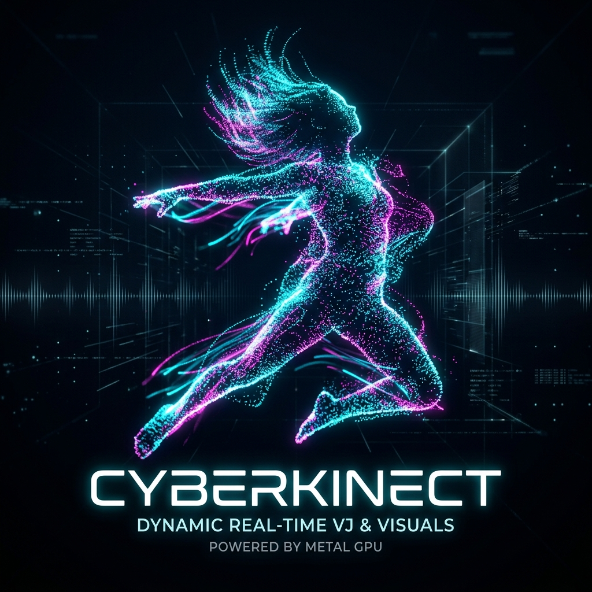

# 🌀 CyberKinect-V2-Pro (Apple Silicon macOS) v1.0



**CyberKinect V2 Pro is a professional high-performance VJ engine for Kinect v2 on Apple Silicon (M1/M2/M3). Built natively with Apple Metal for stable 60 FPS point-cloud rendering. Features 9 visual modes, real-time FFT audio reactivity, auto-calibration, and stage-ready tools like fullscreen and UI toggle. The ultimate VJ artifact for macOS.**

---

## ⚡️ Quick Start (For VJs)
1. **Download**: Grab the latest `CyberKinect_v1.0.zip` from [Releases](../../releases).
2. **Install**: Drag `CyberKinect.app` to your Applications folder.
3. **Connect**: Plug in your Kinect v2 via USB 3.0 (Azure/Xbox One version).
4. **Launch**: Open the app, hit **AUTO** and enjoy.

### 🎮 Controls
- **F**: Toggle Fullscreen Mode.
- **Tab**: Hide/Show the Control Panel.
- **AUTO**: Calibrate depth range automatically.
- **9 Modes**: Press buttons 1-9 to switch visual algorithms.

---

## 🛠 For Developers (Build from Source)

### Dependencies
- **Homebrew**
- **libfreenect2** (Kinect v2 Driver)
- **libusb**

### Automated Build
Simply run the installer script:
```bash
chmod +x INSTALL.sh
./INSTALL.sh
```

---

## 📡 Credits & Acknowledgements
- **OpenKinect**: For the incredible `libfreenect2` driver. [GitHub](https://github.com/OpenKinect/libfreenect2)
- **Apple Metal**: For the GPU performance.
- **Vibecoding**: For the aesthetic and vision.

---

## ⚖️ License
MIT License. Feel free to use in your live performances and art installations.

*Developed with 💜 for the VJ community.*
